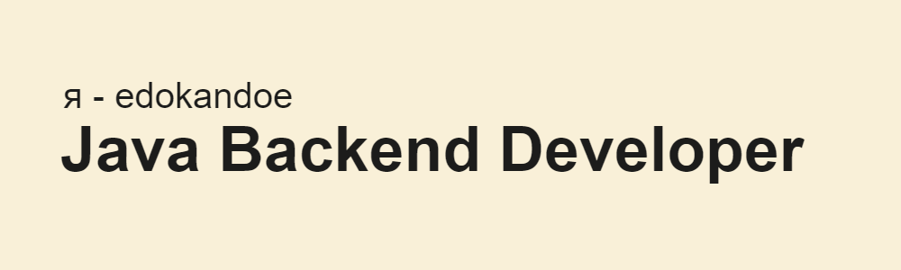

```java
public class Profile {
    private String mainLanguage;
    private String[] additionalLanguages;
    private boolean knowsSQL;

    public Profile() {
        this.mainLanguage = "Java";
        this.additionalLanguages = new String[]{"C#", "C++", "Python"};
        this.knowsSQL = true;
    }

    public void displayProfile() {
        System.out.println("Основной язык программирования: " + mainLanguage);
        System.out.print("Дополнительные языки программирования: ");
        for (String language : additionalLanguages) {
            System.out.print(language + " ");
        }
        System.out.println("\nУмеет работать с базами данных SQL: " + (knowsSQL ? "Да" : "Нет"));
    }

    public static void main(String[] args) {
        Profile profile = new Profile();
        profile.displayProfile();
    }
}
```

## О себе
👋 Привет! Меня зовут Иван, мне 19 лет, и я живу в Прокопьевске, Россия. Недавно я с отличием закончил ГБПОУ ПГТ им. В.П. Романова и сейчас активно развиваюсь в IT-сфере. Моя цель - стать высококвалифицированным backend-разработчиком, изучая востребованные технологии и совершенствуя свои навыки. В данный момент я ищу возможности для сотрудничества и профессионального роста.

В моих планах - переехать в Санкт-Петербург на ПМЖ, так что активно ищу работу именно в этом городе

[](https://git.io/streak-stats)
